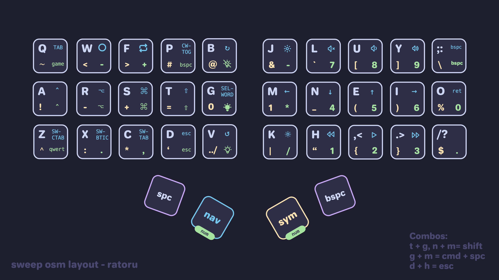

# My QMK Keymaps

These are my keymaps for the [Kyria rev3](https://github.com/splitkb/kyria) and the [Aurora Sweep](https://splitkb.com/collections/keyboard-kits/products/aurora-sweep). Learn more about how and why I created them by reading [my guide](https://ratoru.com/blog/choose-the-right-base-layout).

It was heavily inspired by [Pascal Getreuer's keymap](https://github.com/getreuer/qmk-keymap). It uses a `Colemak-DH` base layer with an option to switch to `Qwerty`. I spent a lot of time trying to design a very efficient symbol layer for programming. To do so, I referred heavily to character and bigram frequencies in programming langues.

The keymap is compiled using a GitHub Action. See more about that below.



## Features

-   Efficient symbol layer.
-   [Word Selection](https://getreuer.info/posts/keyboards/select-word/index.html) macro
-   [Swapper](https://github.com/callum-oakley/qmk_firmware/tree/master/users/callum#swapper). Sends `cmd-key`, but holds `cmd` between consecutive keypresses.
-   QMK Features:
    -   [Dynamic Macros](https://docs.qmk.fm/#/feature_dynamic_macros)
    -   [Caps Word](https://docs.qmk.fm/#/feature_caps_word)
    -   [Layer Lock](https://docs.qmk.fm/features/layer_lock)
    -   Combos. See `combos.inc` for more detail.
    -   Custom repeat keys.
    -   Different useful Macros around browser usage.
-   RGB lighting (= underglow) using `_noeeprom` functions. Uses different colors to indicate current layer. Turns off microcontroller light.
-   Layouts for both home row mods and one-shot modifiers. Note that I do not use home row mods anymore on a daily basis.
    -   For home row mods users: [timeless home row mods](https://github.com/urob/zmk-config#timeless-homerow-mods) implementation for QMK.
    -   Callum style one shot modifiers.
-   Layer keys activated by the thumbs via mod-tap.
-   Hyper key to use as a "leader key" for global shortcuts.

My keymap documentation might not always be up to date. Don't blindly trust the images.

## How to build with GitHub

> [!NOTE]
> The keymaps are compiled for the microcontrollers that I own using `CONVERT_TO=` In the respective `config.h` files. If you have a [different controller](https://docs.qmk.fm/#/feature_converters?id=converters), you might want to change that definition!

✅ Easier. No setup required.

❌ Longer feedback loop. Changes need to go through CI.

1. Push your changes to the remote.

    ```sh
    git push origin main
    ```

2. Wait for the CI to pass. (A GitHub Action will build your firmware.)

    ```sh
    gh run watch
    ```

3. Grab the firmware from the CI artifacts.

    ```sh
    gh run download
    ```

    > ℹ️ Please note that these artifacts are ephemeral and they may be expired if you try to access them later on. You can always grab the latest firmware from the [Releases](https://github.com/mikybars/qmk_userspace/releases) page.

4. Flash the firmware to your keyboard. This depends on your microcontroller. If yours is RP2040 based, take a look at the next section.

## Flashing RP2040 microcontroller

> ⚠️ Please always unplug your keyboard from your computer before removing the TRRS cable!

-   Disconnect TRRS/TRS cable between the splits (keyboard halfs).
-   For each split, do:
    -   Connect your split to the computer using USB.
    -   Press the reset switch of the split two times consequently so that your RP2040 based MCU will go to Bootloader Mode.
    -   You must see Raspberry PI Boot Device in the output of lsusb. It's also detected as Mass Storage Device.
    -   Drag and Drop (cp or copy) the .uf2 file to the RP2040 Mass Storage Device.
    -   After the firmware is copied, you will see that the MCU exits Bootloader mode and Mass Storage Device is no longer present. It means that the firmware is flashed!

## Drawing your keymap

Drawing your keymap can really help you memorize the different layers. Furthermore, it lets others discover your keymap more easily.

The fancy graphics in this repo are custom made. For a more repeatable process I use [keymap-drawer](https://github.com/caksoylar/keymap-drawer).
For example, to generate the sweep `keymap.yaml` file, I ran the following command. It uses `uv` to avoid having to install the tool:

```bash
uvx --from keymap-drawer keymap parse -c 10 -l COLEMAK QWERTY NAV SYM NUM GAME -q keymap.json > sweep_osm.yaml
```

Unfortunately, it does not automatically parse combos. You will have to add those manually. To finally draw the keymap run:

```bash
uvx --from keymap-drawer keymap draw sweep_osm.yaml > sweep_osm_keymap.svg
```

I am also working on a worklfow to automate the drawing.

## My keymaps in detail

Check `docs/generated` for the most up-to-date graphics.
