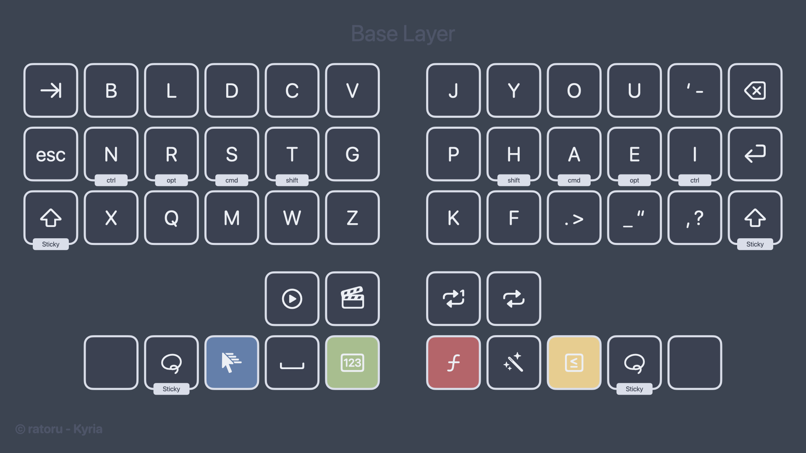
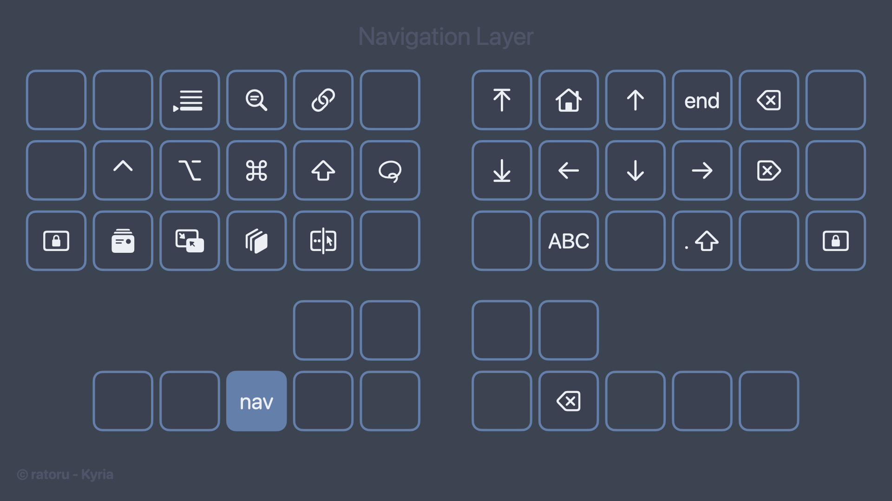
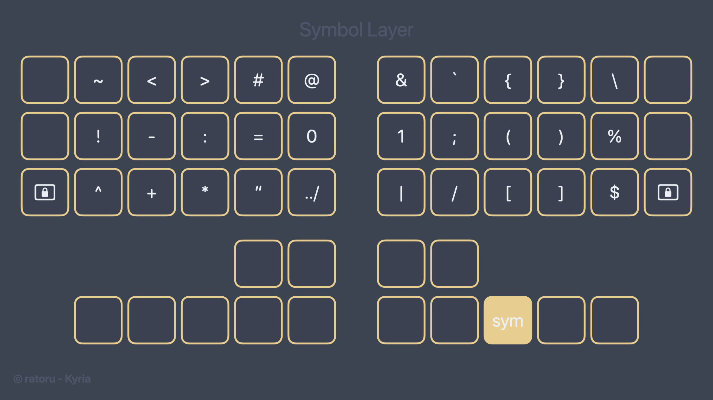
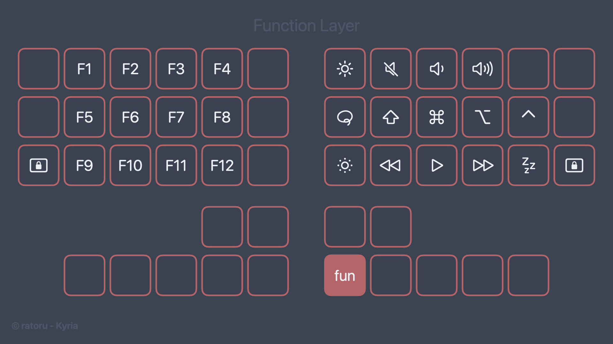

# My QMK Keymaps

These are my keymaps for the [Kyria rev3](https://github.com/splitkb/kyria), [Aurora Sweep](https://splitkb.com/collections/keyboard-kits/products/aurora-sweep), and Corne. Learn more about how and why I created them by reading [my guide](https://ratoru.com/blog/choose-the-right-base-layout).

Since created my first keymap, a lot has changed in the keyboard layout space. The introduction of new evaluation metrics has lead to much more optimized layouts than `Colemak-DH`, my original layout. I am now using `Gallium` with `Graphite` punctuation. To make the Gallium layout work with German, I wrote a custom **magic key**. See the `Arcane` section for more.

I spent a lot of time trying to design a very efficient symbol layer for programming. To do so, I referred heavily to character and bigram frequencies in programming langues.

The keymap is compiled using a GitHub Action. See more about that below. If you compile locally, remember to update the `qmk-firmware` repo periodically.


## Features

- Efficient symbol layer.
- [Word Selection](https://getreuer.info/posts/keyboards/select-word/index.html) macro
- [Swapper](https://github.com/callum-oakley/qmk_firmware/tree/master/users/callum#swapper). Sends `cmd-key`, but holds `cmd` between consecutive keypresses.
- [N-Shot](https://github.com/possumvibes/qmk_userspace/blob/possumdev/users/possumvibes/features/nshot_mod.c) macros.
- QMK Features:
    - [Dynamic Macros](https://docs.qmk.fm/#/feature_dynamic_macros)
    - [Caps Word](https://docs.qmk.fm/#/feature_caps_word)
    - [Layer Lock](https://docs.qmk.fm/features/layer_lock)
    - Combos. See `combos.def` for more detail.
    - Custom repeat keys.
    - Different useful Macros around browser usage.
- RGB lighting (= underglow) using `_noeeprom` functions. Uses different colors to indicate current layer. Turns off microcontroller light.
- Layouts for both home row mods and one-shot modifiers. Note that I do not use home row mods anymore on a daily basis due to the input lag.
- Layer keys activated by the thumbs via mod-tap.
- Hyper key to use as a "leader key" for global shortcuts.

My keymap documentation might not always be up to date. Don't blindly trust the images.

### Arcane Key

My `ARCANE` key mixes the functionality of a **repeat key** and a **magic key**.

- If there is no custom functionality, the previous key will be repeated.
- One-shot shift after space or after keyboard idle.
- Outputs German Umlaute.
- Avoids difficult SFBs.
- Completes common trigrams (`ion` in English and `sch` in German).
- Outputs common words after shifted letters, e.g. `D->anke`, `T->hank`.

The exact bindings can be found in `features/arcane.c`.

## How to build with GitHub

> [!NOTE]
> The keymaps are compiled for the microcontrollers that I own using `CONVERT_TO=` In the respective `config.h` files. If you have a [different controller](https://docs.qmk.fm/#/feature_converters?id=converters), you might want to change that definition!

✅ Easier. No setup required.

❌ Longer feedback loop. Changes need to go through CI.

1. Push your changes to the remote.

    ```sh
    git push origin main
    ```

2. Wait for the CI to pass. (A GitHub Action will build your firmware.)

    ```sh
    gh run watch
    ```

3. Grab the firmware from the CI artifacts.

    ```sh
    gh run download
    ```

    > ℹ️ Please note that these artifacts are ephemeral and they may be expired if you try to access them later on. You can always grab the latest firmware from the [Releases](https://github.com/mikybars/qmk_userspace/releases) page.

4. Flash the firmware to your keyboard. This depends on your microcontroller. If yours is RP2040 based, take a look at the next section.

## Flashing RP2040 microcontroller

> [!WARNING]
> Please always unplug your keyboard from your computer **before** removing the TRRS cable
> to prevent short-circuiting your board!

- Disconnect TRRS/TRS cable between the splits (keyboard halves).
- For each split, do:
    - Connect your split to the computer using USB.
    - Press the reset switch of the split twice. Your RP2040 based MCU will go into Bootloader Mode.
    - Your device should appear as a Mass Storage Device. You can also see Raspberry PI Boot Device in the output of lsusb.
    - Drag and Drop (cp or copy) the `.uf2` file to the RP2040 Mass Storage Device.
    - After the firmware is copied, you will see that the MCU exits Bootloader mode and Mass Storage Device is no longer present. It means that the firmware is flashed!
- After flashing both halves, disconnect your half, reconnect the halves with the TRRS cable, and plug your keyboard back in. Enjoy!

## Drawing your keymap

Drawing your keymap can really help you memorize the different layers. Furthermore, it lets others discover your keymap more easily.

The fancy graphics in this repo are custom made. For a more repeatable process I use [keymap-drawer](https://github.com/caksoylar/keymap-drawer). The commands to draw an individual keymap file can be found in `keyboards/*/draw.sh`. To quickly re-draw a keymap, run the following:

```bash
just draw
```

I am also working on a worklfow to automate the drawing.

## My keymaps in detail

Check `docs/generated` for the most up-to-date graphics.

### Kyria

**Base Layer**: My base layer is a mix of Gallium and Graphite punctuation.



**Navigation Layer**:



**Symbol Layer**:



**Function Layer**: This is home of the function keys and other system related operations.



## Setting up your LSP

To make your LSP pick up the correct imports, you need to run one of the `just build ...` commands.
`clangd` will then pick up the correct imports for the keymap you are currently working on. Currently,
you have to run this build command each time you work on a different keymap.

## Future additions

- X-case
