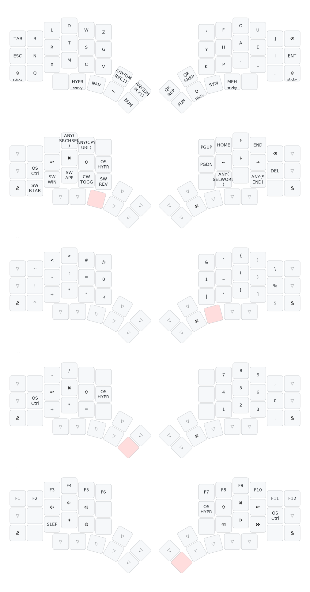

# Kyria Keymap



---

Run `just draw`. Under the hood it does the following:

Redraw the `svg` file with the following. Remember to update the layer names (`-l`) if you change them.

```bash
uvx --from keymap-drawer keymap parse -c 12 -l GRAPHITE NAV SYM NUM FUN -q keymap.json > kyria_graphite.yaml
uvx --from keymap-drawer keymap draw kyria_graphite.yaml > kyria_graphite.svg
```
