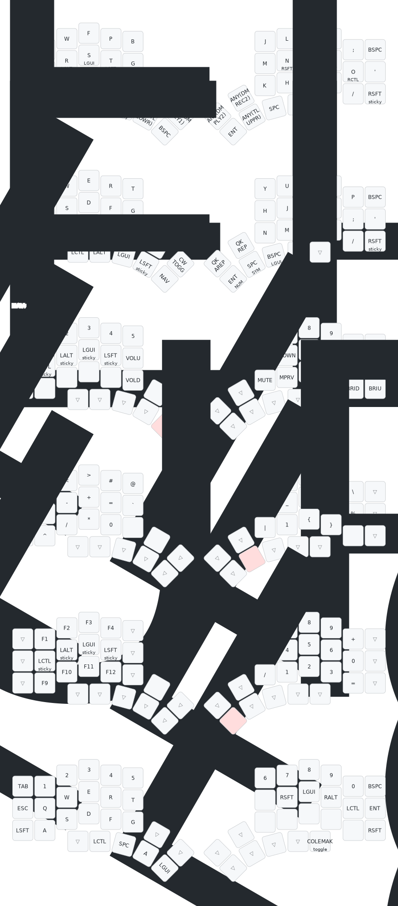

# Kyria Homerow Mods Keymap



---

Redraw the `svg` file with the following. Remember to update the layer names (`-l`) if you change them.

```bash
uvx --from keymap-drawer keymap parse -c 12 -l COLEMAK QWERTY NAV SYM NUM FUN GAME -q keymap.json > kyria_hrm_keymap.yaml
uvx --from keymap-drawer keymap draw kyria_hrm.yaml > kyria_hrm_keymap.svg
```

